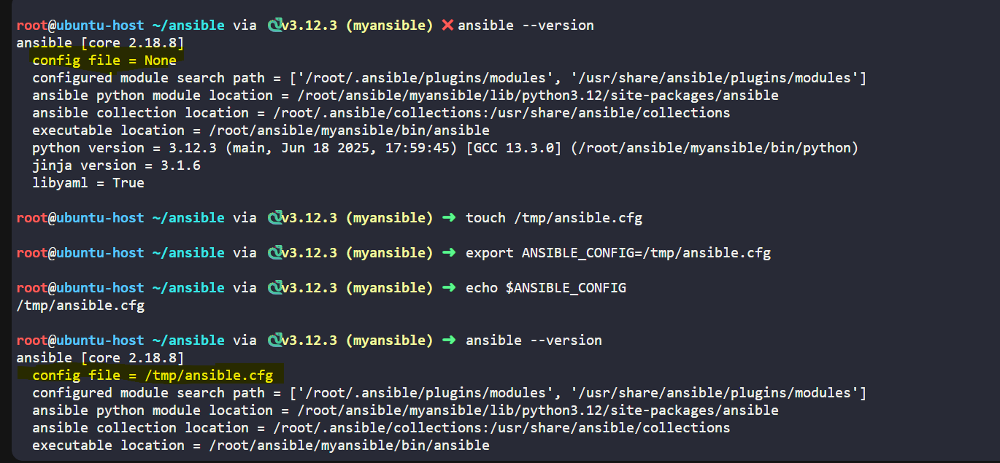
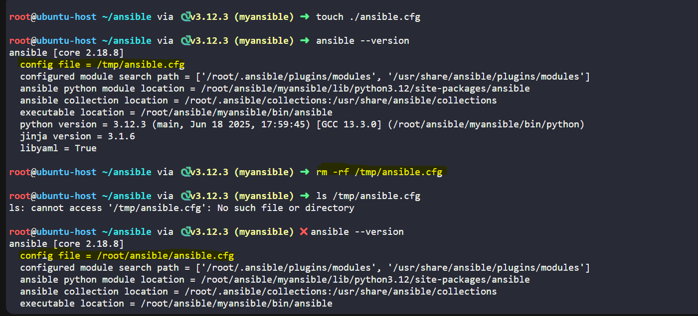
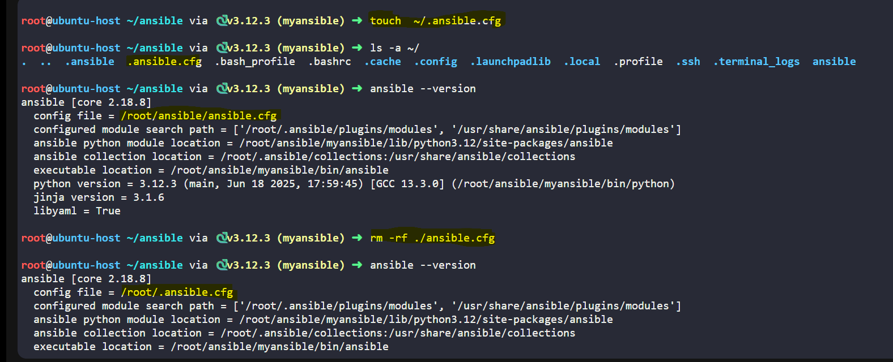

### Path Preferences

| Priority | Location |
|----------|----------|
| **ANSIBLE_CONFIG** | Environment Variable |
| **Current Dir** | ./ansible.cfg |
| **Hidden file in Home Dir** | ~/.ansible.cfg |
| **Ansible config at etc** | /etc/ansible/ansible.cfg |

---

**Create ansible config as env:**



**Create ansible on current directory:**



**Create ansible config file on user home directory:**



```bash
ANSIBLE_KEEP_REMOTE_FILE=1 ansible-playbook lineinfile.yaml
```