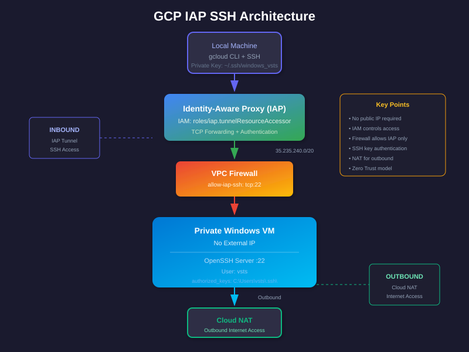
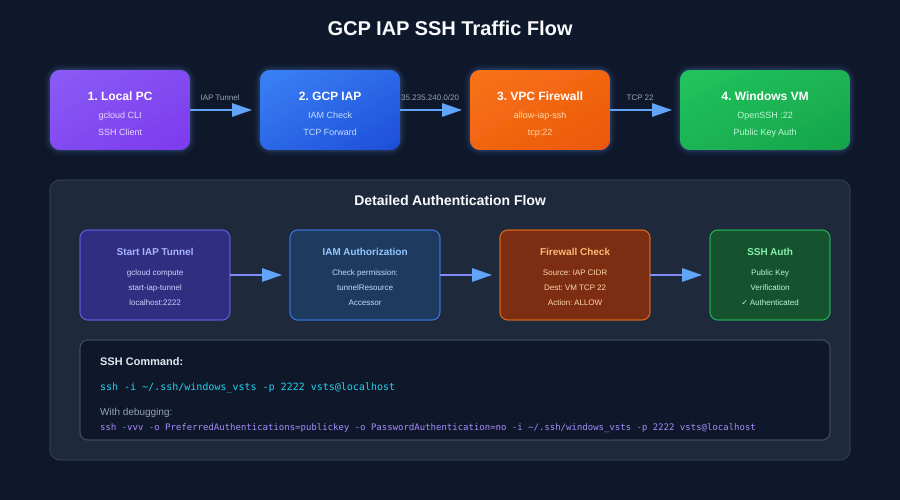

# GCP IAP → Windows VM → SSH

## 1. Architecture

The goal is to connect to a private Windows VM using SSH through Google Cloud Identity-Aware Proxy (IAP).



```text
Your PC
   |
   | gcloud + SSH
   v
GCP IAP
   |
   | TCP :22
   v
VPC Firewall
   |
   v
Private Windows VM
   |
   | Windows OpenSSH :22
   v
SSH User

Private VM
   |
   | Outbound internet
   v
Cloud NAT
   |
   v
Internet
```

## 2. Components

- VPC Network
- Subnet
- Private Windows VM
- Cloud Router
- Cloud NAT
- IAP firewall rule
- IAM policy binding
- Windows OpenSSH Server
- SSH key pair
- GCP Compute Engine metadata
- IAP TCP tunneling

## 3. Prerequisites

```bash
gcloud version
gcloud auth login
gcloud config set project PROJECT_ID
gcloud config get-value project
```

## 4. Enable APIs

```bash
gcloud services enable compute.googleapis.com
gcloud services enable iap.googleapis.com
```

## 5. Create VPC

```bash
gcloud compute networks create iap-windows-vpc \
    --subnet-mode=custom
```

## 6. Create Subnet

```bash
gcloud compute networks subnets create windows-subnet \
    --network=iap-windows-vpc \
    --region=asia-south1 \
    --range=10.10.10.0/24
```

## 7. Create Cloud Router

```bash
gcloud compute routers create windows-router \
    --network=iap-windows-vpc \
    --region=asia-south1
```

## 8. Create Cloud NAT

The Windows VM has no public IP, so Cloud NAT provides outbound internet access.

```bash
gcloud compute routers nats create windows-nat \
    --router=windows-router \
    --region=asia-south1 \
    --nat-all-subnet-ip-ranges \
    --auto-allocate-nat-external-ips
```

Verify:

```bash
gcloud compute routers nats list \
    --router=windows-router \
    --region=asia-south1
```

Cloud NAT provides outbound connectivity only. It does not expose the Windows VM to the internet.

## 9. Create Private Windows VM

```bash
gcloud compute instances create windows-iap-vm \
    --zone=asia-south1-a \
    --machine-type=e2-medium \
    --network=iap-windows-vpc \
    --subnet=windows-subnet \
    --no-address \
    --image-family=windows-2022 \
    --image-project=windows-cloud
```

Important:

```text
--no-address
```

means the VM does not receive a public IP.

## 10. IAP Firewall Rule

IAP TCP forwarding uses the source range:

```text
35.235.240.0/20
```

Create the firewall rule:

```bash
gcloud compute firewall-rules create allow-iap-ssh \
    --network=iap-windows-vpc \
    --direction=INGRESS \
    --action=ALLOW \
    --rules=tcp:22 \
    --source-ranges=35.235.240.0/20
```

Verify:

```bash
gcloud compute firewall-rules describe allow-iap-ssh
```

Traffic flow:

```text
Your PC
   |
   v
IAP
   |
   | Source: 35.235.240.0/20
   | TCP 22
   v
VPC Firewall
   |
   v
Windows VM
```

## 11. IAM Policy Binding

The user needs permission to establish an IAP tunnel.

Grant:

```text
roles/iap.tunnelResourceAccessor
```

Example:

```bash
gcloud projects add-iam-policy-binding PROJECT_ID \
    --member="user:YOUR_EMAIL@example.com" \
    --role="roles/iap.tunnelResourceAccessor"
```

Verify:

```bash
gcloud projects get-iam-policy PROJECT_ID \
    --flatten="bindings[].members" \
    --filter="bindings.members:YOUR_EMAIL@example.com" \
    --format="table(bindings.role)"
```

Expected:

```text
roles/iap.tunnelResourceAccessor
```

### IAM vs Firewall

IAM answers:

> Is the user allowed to create an IAP tunnel?

Firewall answers:

> Is IAP allowed to reach TCP port 22 on the VM?

Both controls are required.

```text
User
 |
 | IAM
 v
IAP
 |
 | Firewall
 v
Windows VM
```

## 12. Install Windows OpenSSH

On the Windows VM:

```powershell
Get-Service sshd
```

If OpenSSH Server is not installed:

```powershell
Add-WindowsCapability -Online -Name OpenSSH.Server~~~~0.0.1.0
```

Start it:

```powershell
Start-Service sshd
```

Enable automatic startup:

```powershell
Set-Service -Name sshd -StartupType Automatic
```

Verify:

```powershell
Get-Service sshd
```

## 13. Windows Firewall

Allow TCP 22:

```powershell
New-NetFirewallRule `
    -Name "OpenSSH-Server-In-TCP" `
    -DisplayName "OpenSSH Server (TCP 22)" `
    -Enabled True `
    -Direction Inbound `
    -Protocol TCP `
    -LocalPort 22 `
    -Action Allow
```

Verify:

```powershell
Get-NetFirewallRule -Name "OpenSSH-Server-In-TCP"
```

## 14. Create Windows SSH User

```powershell
New-LocalUser `
    -Name "vsts" `
    -Password (Read-Host -AsSecureString)
```

If administrator privileges are required:

```powershell
Add-LocalGroupMember `
    -Group "Administrators" `
    -Member "vsts"
```

Verify:

```powershell
Get-LocalGroupMember Administrators
```

## 15. Generate SSH Key

On the local Linux/WSL machine:

```bash
ssh-keygen -t ed25519 \
    -C "logesh-test" \
    -f ~/.ssh/windows_vsts
```

This creates:

```text
~/.ssh/windows_vsts
~/.ssh/windows_vsts.pub
```

The private key stays on the local machine.

The public key is copied to the Windows VM.

## 16. Verify SSH Key Fingerprint

```bash
ssh-keygen -lf ~/.ssh/windows_vsts.pub
```

Example:

```text
256 SHA256:5vPNWEBa1eSJ7ogODWq97igLyAficR0eF0HEmmDsNlQ logesh-test (ED25519)
```

The fingerprint is useful when troubleshooting key mismatches.

## 17. Configure authorized_keys

For a normal Windows user:

```powershell
New-Item -ItemType Directory `
    -Path "C:\Users\vsts\.ssh" `
    -Force
```

Add the public key:

```powershell
Add-Content `
    -Path "C:\Users\vsts\.ssh\authorized_keys" `
    -Value "ssh-ed25519 AAAA... logesh-test"
```

Verify:

```powershell
Get-Content "C:\Users\vsts\.ssh\authorized_keys"
```

## 18. Check Permissions

```powershell
icacls "C:\Users\vsts\.ssh"
```

```powershell
icacls "C:\Users\vsts\.ssh\authorized_keys"
```

Typical permissions should allow:

```text
SYSTEM              Full Control
Administrators      Full Control
vsts                Full Control
```

Avoid allowing arbitrary users write access to the SSH key files.

## 19. OpenSSH authorized_keys Configuration

Check:

```powershell
Select-String `
    -Path "C:\ProgramData\ssh\sshd_config" `
    -Pattern "Match Group|AuthorizedKeysFile"
```

Example:

```text
AuthorizedKeysFile .ssh/authorized_keys

Match Group administrators
       AuthorizedKeysFile __PROGRAMDATA__/ssh/administrators_authorized_keys
```

### Important

If the SSH user is a member of the local `Administrators` group, the `Match Group administrators` block can cause OpenSSH to use:

```text
C:\ProgramData\ssh\administrators_authorized_keys
```

instead of:

```text
C:\Users\vsts\.ssh\authorized_keys
```

This is an important Windows OpenSSH troubleshooting point.

## 20. Check Whether the Administrator Key File Exists

```powershell
Test-Path "C:\ProgramData\ssh\administrators_authorized_keys"
```

If it returns:

```text
False
```

the file does not exist.

Check whether the user is an administrator:

```powershell
Get-LocalGroupMember Administrators
```

## 21. Effective OpenSSH Configuration

Run:

```powershell
sshd.exe -T | Select-String `
    "authorizedkeysfile|pubkeyauthentication"
```

Example:

```text
pubkeyauthentication yes
authorizedkeysfile .ssh/authorized_keys
```

This verifies that public-key authentication is enabled.

## 22. Restart OpenSSH

After changing `sshd_config`:

```powershell
Restart-Service sshd
```

Verify:

```powershell
Get-Service sshd
```

## 23. OpenSSH Logs

Check:

```powershell
Get-WinEvent `
    -LogName "OpenSSH/Operational" `
    -MaxEvents 30 |
    Format-List TimeCreated, Id, LevelDisplayName, Message
```

Successful key authentication should contain something similar to:

```text
Accepted publickey for vsts
```

Failed key authentication can show:

```text
Failed publickey for vsts
```

## 24. Create IAP Tunnel

From the local machine:

```bash
gcloud compute start-iap-tunnel windows-iap-vm 22 \
    --local-host-port=localhost:2222 \
    --zone=asia-south1-a
```

Expected:

```text
Listening on port [2222].
```

Keep this terminal open.

## 25. SSH Through the IAP Tunnel

Open another terminal:

```bash
ssh \
    -i ~/.ssh/windows_vsts \
    -p 2222 \
    vsts@localhost
```

For detailed debugging:

```bash
ssh -vvv \
    -o PreferredAuthentications=publickey \
    -o PasswordAuthentication=no \
    -i ~/.ssh/windows_vsts \
    -p 2222 \
    vsts@localhost
```

A successful authentication should eventually show:

```text
Authentication succeeded (publickey)
```

and provide a Windows shell:

```text
PS C:\Users\vsts>
```

## 26. Troubleshooting Public Key Authentication

If you receive:

```text
Permission denied (publickey,password,keyboard-interactive)
```

check the following.

### Check user

```powershell
Get-LocalUser vsts | Select-Object Name,Enabled,SID
```

### Check group membership

```powershell
Get-LocalGroupMember Administrators
```

### Check authorized_keys

```powershell
Get-Content "C:\Users\vsts\.ssh\authorized_keys"
```

### Check permissions

```powershell
icacls "C:\Users\vsts\.ssh"
```

```powershell
icacls "C:\Users\vsts\.ssh\authorized_keys"
```

### Check OpenSSH configuration

```powershell
Select-String `
    -Path "C:\ProgramData\ssh\sshd_config" `
    -Pattern "Match Group|AuthorizedKeysFile"
```

### Check effective configuration

```powershell
sshd.exe -T | Select-String `
    "authorizedkeysfile|pubkeyauthentication"
```

### Check OpenSSH logs

```powershell
Get-WinEvent `
    -LogName "OpenSSH/Operational" `
    -MaxEvents 30 |
    Format-List TimeCreated, Id, LevelDisplayName, Message
```

## 27. Key Fingerprint Troubleshooting

On the local machine:

```bash
ssh-keygen -lf ~/.ssh/windows_vsts.pub
```

Example:

```text
256 SHA256:5vPNWEBa1eSJ7ogODWq97igLyAficR0eF0HEmmDsNlQ logesh-test (ED25519)
```

The Windows `authorized_keys` file must contain the corresponding public key.

Example:

```powershell
Get-Content "C:\Users\vsts\.ssh\authorized_keys"
```

The comment:

```text
logesh-test
```

is only a label. The actual public key material is what must match.

## 28. IAP vs Cloud NAT

These have different purposes.

### IAP

```text
Your PC
   |
   v
IAP
   |
   v
Private Windows VM
```

IAP provides controlled inbound administrative access.

### Cloud NAT

```text
Private Windows VM
   |
   v
Cloud NAT
   |
   v
Internet
```

Cloud NAT provides outbound internet access.

Therefore:

```text
IAP       = inbound administrative access
Cloud NAT = outbound internet access
```

## 29. Complete Traffic Flow

```text
                         LOCAL MACHINE
                              |
                              |
                    gcloud start-iap-tunnel
                              |
                              v
                    +-------------------+
                    |       GCP IAP     |
                    |                   |
                    | IAM permission    |
                    | tunnelResource    |
                    | Accessor          |
                    +---------+---------+
                              |
                              |
                     Source: 35.235.240.0/20
                              |
                              | TCP 22
                              v
                    +-------------------+
                    |   VPC FIREWALL    |
                    |                   |
                    | allow-iap-ssh     |
                    | tcp:22            |
                    +---------+---------+
                              |
                              v
                    +-------------------+
                    |  WINDOWS VM       |
                    |                   |
                    | Private IP        |
                    | No external IP    |
                    | OpenSSH :22       |
                    +---------+---------+
                              |
                              | Outbound
                              v
                    +-------------------+
                    |    CLOUD NAT      |
                    +---------+---------+
                              |
                              v
                         INTERNET
```

## 30. Validation Checklist

```text
[ ] GCP project selected
[ ] Compute API enabled
[ ] IAP API enabled
[ ] VPC created
[ ] Subnet created
[ ] Cloud Router created
[ ] Cloud NAT created
[ ] Windows VM created
[ ] Windows VM has no external IP
[ ] IAP firewall rule created
[ ] roles/iap.tunnelResourceAccessor granted
[ ] OpenSSH Server installed
[ ] sshd service running
[ ] Windows firewall allows TCP 22
[ ] SSH user exists
[ ] SSH public/private key generated
[ ] Public key copied to Windows
[ ] File permissions verified
[ ] sshd_config checked
[ ] sshd.exe -T verified
[ ] sshd restarted
[ ] IAP tunnel created
[ ] SSH tested with private key
```

## 31. Final Test

### Terminal 1

```bash
gcloud compute start-iap-tunnel windows-iap-vm 22 \
    --local-host-port=localhost:2222 \
    --zone=asia-south1-a
```

### Terminal 2

```bash
ssh \
    -o PreferredAuthentications=publickey \
    -o PasswordAuthentication=no \
    -i ~/.ssh/windows_vsts \
    -p 2222 \
    vsts@localhost
```

Expected:

```text
PS C:\Users\vsts>
```

## 32. Final Architecture



```text
                         Internet
                            |
                            |
                    +-------v-------+
                    |      IAP      |
                    +-------+-------+
                            |
                     IAM permission
                            |
                            v
                    +---------------+
                    | VPC Firewall  |
                    | TCP 22        |
                    | IAP CIDR      |
                    +-------+-------+
                            |
                            v
                 +----------------------+
                 |   Private Windows VM |
                 |                      |
                 |   OpenSSH :22        |
                 |   vsts user          |
                 |   SSH public key     |
                 |                      |
                 |   No Public IP       |
                 +----------+-----------+
                            |
                            | Outbound
                            v
                       Cloud NAT
                            |
                            v
                         Internet
```

## 33. Key Takeaways

### IAP

Secure access to a private VM:

```text
IAP → Private VM
```

### IAM

Controls who can use IAP:

```text
roles/iap.tunnelResourceAccessor
```

### Firewall

Allows IAP traffic to SSH:

```text
35.235.240.0/20 → TCP 22
```

### Cloud NAT

Provides outbound internet access:

```text
Private VM → Cloud NAT → Internet
```

### OpenSSH

Provides SSH service:

```text
TCP 22
```

### authorized_keys

Contains the public SSH key:

```text
C:\Users\vsts\.ssh\authorized_keys
```

or, depending on the Windows OpenSSH `Match Group administrators` configuration:

```text
C:\ProgramData\ssh\administrators_authorized_keys
```

### Private Key

Stays on the local machine:

```text
~/.ssh/windows_vsts
```

### Public Key

Is installed on the Windows VM:

```text
~/.ssh/windows_vsts.pub
        ↓
authorized_keys
```

## 34. End State

The complete setup provides:

```text
Local PC
   ↓
GCP IAP
   ↓
IAM authorization
   ↓
VPC Firewall
   ↓
Private Windows VM
   ↓
Windows OpenSSH
   ↓
SSH Public Key Authentication
   ↓
vsts user
```

The Windows VM has no public IP, SSH is not directly exposed to the internet, IAP controls administrative access, and Cloud NAT provides outbound connectivity.
